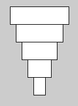

# DT508 Game Programming 2016-2017

Resources
---------
* [Webcourses](http://dit.ie/webcourses) - Course code GAME1003
* [Slack](https://gp-2016-2017.slack.com)
* [Processing](http://processing.org)
* [The Processing language reference](http://processing.org/reference/)
* [Learning Processing: A Beginner's Guide to Programming Images, Animation, and Interaction (Morgan Kaufmann Series in Computer Graphics)](http://http://www.learningprocessing.com/)
* [The Nature of Code](http://natureofcode.com/)
* [The git manual - read the first three chapters](http://git-scm.com/documentation)
* [A video tutorial all about git/github](https://www.youtube.com/watch?v=p_PGUltnB6w)
* [Games Fleadh](http://www.gamesfleadh.ie/)
* [The Imagine Cup](https://www.imaginecup.com/)

## Contact the lecturer

* Email: bryan.duggan@dit.ie
* Twitter: [@skooter500](http://twitter.com/skooter500)
* Slack: [gp-2016-2017.slack.com](https://gp-2016-2017.slack.com)

## Assignments

- [Assignments & rubrics](assignments.md)

Some assignments from previous years:

[](https://www.youtube.com/watch?v=4g3qwul2o44)

[](https://www.youtube.com/watch?v=ObH8ffqzseU)

[](https://www.youtube.com/watch?v=BH4alGk5-A4)

# Semester 1

# Week 10
- [Game of Life complete](processing/LifeWIP)

## Lab
### Learning Outcomes
- Experiment making creatures in Conway's Game of Life
- Practice iterating over a 2D array
- Discover the amazing power of cellular automata

For today, please start with the [Game of Life](processing/LifeWIP) code we wrote in the class yesterday and make the following changes:

- When you press the space key, the game should pause and unpause, in other words, not update the game board while the game is paused
- When you press the c key, the board should clear. In otherwords, you should set every element in th 2D array to be false.
- When you press the r key, you should randomly set 50% of the elements to be true. To do this, you need to iterate through the array and generate a random number between 0.0f and 1.0f. If the number is > 0.5f, you set the element to be true otherwise set it to be false.

There some interesting starting patterns you can program also. You could write code so that when you press a number key it creates the starting pattern at the mouse x and y. I used the mouse x and y to be the top left of the shape.

| Pattern | Description |
|---------|-------------|
| | Gosper Gun |
| | Lightweight spaceship |
| | Tumbler |
| | Glider |
| | I'm not sure what this is called, but it makes amazing patterns |

Please share your work on the class slack!

# Week 9
- [Incomplete Game of Life code for the lab today](processing/LifeWIP)

- Stephen Hawkings on the Game of Life:

  [](https://www.youtube.com/watch?v=CgOcEZinQ2I)

- John Conway on the Game of Life:

  [](https://www.youtube.com/watch?v=C2vgICfQawE)

- Epic Conway's Game of Life:

  [](https://www.youtube.com/watch?v=FdMzngWchDk)

- And finally, Alan Watts

  [](https://www.youtube.com/watch?v=wU0PYcCsL6o)

- [Conway's Game of Life on Wikipedia](https://en.wikipedia.org/wiki/Conway%27s_Game_of_Life)
- [The Game of Life Wiki](http://www.conwaylife.com/wiki/Main_Page)

## Lab
### Learning Outcomes
- Practice iterating over a 2D array
- Practice writing if statements
- Write and call a method

Get the code that we worked on yesterday from Slack. We will finish off implementing the Game of Life next week, but for now lets try and make the following additions:

- Finish writing the method ```countLiveCellsSurrounding```. You can test your implementation by setting some cells to be true  and calling the method from setup and printing the results. For example, using the code from the class and adding the line:


  ```
  println(countLiveCellsSurrounding(0,2));
  ```

  Should print 3 because there are 3 live cells around cell (0, 2)

- The method ```void mousePressed()``` gets called in your sketch whenever the mouse is pressed. The method ```mouseDragged``` gets called whenever you hold the mouse down and move it over your sketch. You can get the mouse x and y coordinates by using the built in variables ```mouseX``` and ```mouseY```. You can use these methods to implement mouse drawing. To do this you need to calculate which row and column in the 2D array the mouse is over and then set this cell to be true.

- When you press the c key, the board should clear. In otherwords, you should set every value in the 2D array to be false.
- When you press the r key, you should randomly set 50% of the values to be true and 50% to be false. To do this, you need to iterate through the 2D array and generate a random number between 0.0f and 1.0f. If the number is > 0.5f, you set the value at the row and column to be true otherwise set it to be false.

Here is a video of what my sketch looks like:

[](https://www.youtube.com/watch?v=72X38iT74As)

# Week 8
- [Lab Test](https://github.com/skooter500/GP_Lab_Test_1/)

# Week 7
- [Methods in processing](https://processing.org/examples/functions.html)
- [The arrays program we wrote in the class today](processing/arrays)
- All about arrays in processing:

  [](https://www.youtube.com/watch?v=cMWxN4j30A0)

## Lab
### Learning outcomes
- Learn how to allocate arrays
- Learn how to store values in arrays
- Practice iterating arrays

Here is the rainfall data recorded at the Dublin Airport over 12 months of 2010:

| Month | Amount in mm |
|-------|--------------|
| Jan | 45 |
| Feb | 37 |
| March | 55 |
| April | 27 |
| May | 38 |
| June | 50 |
| July | 79 |
| August | 48 |
| September | 104 |
| October | 31 |
| November | 100 |
| December | 58 |

Create a Processing sketch and do the following:

- Allocate two arrays for storing the month names and the rainfall data
- Calculate the average rainfall for that year
- Calculate the month with the highest rainfall
- Calculate the month with the lowest rainfall

Now see if you can write code to generate the following graphs of the rainfall data:

- A bar chart:

  

- A trend line:

  

Advanced:

Try and draw a pie chart!


Hint! for the bar chart, it might be useful to allocate a third array to hold the colours. You an use random colours so that every month has a different colour.

Upload screenshots of your sketches to slack and do the MCQ for today.

# Week 6
- [BugZap work in progress from the class](processing/BugZap)
- [Lab test 1 from last year](https://github.com/skooter500/dt508_2015_labtest1)

## Lab
### Learning Outcomes
- Implement a complete simple game project!
- Use if statements, methods and the % operator
- Model a game system in code (scoring, movement, collisions)

Today let's finish programming BugZap. Start with [the code we wrote in the class yesterday](processing/BugZap). Use your creativity and change colours and shapes of the player and bug.

Here is a video of my version:

[](https://www.youtube.com/watch?v=s6PA8jtWneQ)

- Now add the player lazer. I used to UP key for this. I just drew a line for the lazer.
- Make a variable for score and check for collisions between the lazer and the bug. Add a variable for score. You can print stuff to the screen using the text method in Processing. In my version, I actually used [this processing library](http://www.foobarquarium.de/blog/processing/MovingLetters/) which makes wireframe text.
- Make some sound effects and add them to the game. I used [BFXR](http://www.bfxr.net/) to make the sounds and the Minim library to play them, but you might prefer to use the [built-in audio methods in Processing](https://processing.org/tutorials/sound/).
- Add the splash screen and game over screen. I used an int variable called gameState to control this.

Upload pictures of your creations to the Slack. There is no MCQ this week

- [Complete BugZap!](https://github.com/skooter500/BugZap)

# Week 5
- [Lots of loops examples](processing/lotsaloops)
- [The lines program we wrote in the class](processing/starship)
- Video all about loops n stuff from last year:

  [](https://www.youtube.com/watch?v=fcHfysgK9iw)

## Lab
### Learning outcomes
- Practice generating lots of different shapes with loops in processing
- Be creative and make something beautiful in code

Try and write some processing code to draw the following shapes. Use variables and loops in your solutions!

Its best to spend some time thinking about the variables and how they are changing before writing code:

These require ONE loop:



This shape draws lines from the sides that all meet in the middle. This can be done using one loop, but is better with two:


This sketch always draws 10 equally sized circles across the screen. This should work no matter what you set the screen size to. You should also declare a variable to hold the number of circles to draw so that if you change this number, the sketch should still work:


This sketch places circles around the outside of a bigger circle to make a flower pattern. Once you figure this out, you can modify it to do something cool with colours:


This sketch prints the numbers of the clock around in a circle:


Finally! This sketch requires you to put one loop inside another and also use a boolean variable, though there are other ways to do this:


This is what it looks like when all the above code is in one sketch:


Please use lots of colours and stuff in your sketches today and share pictures on the slack. Also I created a channel on the slack for us to share our favourite coding music.

Do the MCQ

- [Solution to the lab](processing/loopsLab)

# Week 4

## Lecture

- [Program we wrote to draw a spiral](processing/spirals)
- [Program plot the sine wave](processing/sinewave)
- [The exam grade sketch we wrote in the class](processing/examMarks)
- [My spiral generative art](http://github.com/skooter500/genart1)
- Making Spirals in Processing lecture:

  [](https://www.youtube.com/watch?v=wVivMDVRs3I)

- Variables & trigonometry:

  [](https://www.youtube.com/watch?v=xkK5C7Xfx80)

## Lab
  Today we are having a Spiral Jam

- What I want you to do it:
  - Form a team of no more than three people. Just the people sitting next to you is fine!
  - Firstly, go through the examples from the class and explain them to each other to make sure you all understand what is happening.
  - Now I want you to design a spiral or similar shape of your teams design. Just using the stuff we have learned in the class. In your spiral design, you can use
    - Variables
    - sin, cos, tan
    - angles
    - Variable operations like addition, subtraction etc
    - Colour methods and random colours
    - line, ellipse, rect etc.
  - Before you write any code decide using pen and paper:
    - What variables you need
    - Whether the variables should be local or global
    - What happens to the variables each frame (what operations to perform)
    - What to draw
    - What decisions your program has to make - what if statements you need

Here are some additional Processing methods you can incorporate into your sketches. Be brave! Look these up and try them out in your sketches and see if you can figure out how they work:

- [noise](https://processing.org/reference/noise_.html)
- [map](https://processing.org/reference/map_.html)
- [translate](https://processing.org/reference/translate_.html)
- [rotate](https://processing.org/reference/rotate_.html)
- [lerp](https://processing.org/reference/lerp_.html)
- [lerpColor](https://processing.org/reference/lerpColor_.html)

Also if you want to try making sound in Processing, you can use the [Minim library](http://code.compartmental.net/tools/minim/)

A gold star to the team that produces the sketch of the best design and complexity. Think simplicity in the design of your code and only use the minimum onumber of variables to solve your problem.

Upload your sketches to the Slack!

# Week 3
- [Quardants sketch](processing/quadrants)
- [Moving rectangle with an if statement](processing/rectangle/rectangleWithIf)

### Some videos about the if statement

[](https://www.youtube.com/watch?v=mVq7Ms01RjA)

[](https://www.youtube.com/watch?v=9857701OsDE)

## Lab
### Learning outcomes
- Practice using variables & offsets
- Practice using the if statement

In the class we used the if statement to get a rectangle to move from left top right across the screen and back again. Here is a [link to that sketch](processing/rectangle). Try and modify that it draws a face  that starts in the middle of the screen and then moves around the outside of the screen. This is a little trickey to get right. You should < > in your if statement and if the face goes beyond the bounds of the window, you need to move it back inside the window. Here is a video of what your sketch should look like:

[](https://www.youtube.com/watch?v=lA-3AROmMiE)

- [Solution to the lab](processing/facearoundthewall)

Do the MCQ

# Week 2
- [Program with the moving rectangle](processing/rectangle)
- [Program that draws a spiral](processing/variables)
- [Using variables in processing](https://processing.org/examples/variablescope.html)

- Data types, the if statement and dynamic sketches in Processing video (from last year)

  [](https://www.youtube.com/watch?v=Y0b9W3UJ2BU)

## Lab

### Learning Outcomes
- Learn how to analyse a problem and figure out a solution
- Practice drawing in processing
- Practice using variables
- Practice using operations

Here is a video of a sketch you can make today:

[](https://www.youtube.com/watch?v=uvPVGiU-bn4)

What is happening:

- The ground takes up half the window size
- The spaceship is 100 pixels wide and is *centered* around the mouse position.
- The person starts at the right side of the screen and moved from right to left

Use variables wherever practical in your sketch and calculate positions and sizes relative to these variables.

Bonus!

There are few things you can try (but you will probably have to read ahead and figure out how the if statement works)

- Come up with a more beautiful looking spaceship and person
- Change the colours of everything
- Make a car that drives from left to right
- When the person reaches the left side of the screen, he should switch direction
- Make the lights on the spaceship flash different colours

Post a picture of your creation on the slack.

[Log onto webcourses](http://dit.ie/webcourses) and do this weeks MCQ.

- [Solution to the lab](processing/alien)

# Week 1

## Lecture
- [Introduction slides](https://1drv.ms/p/s!Ak7y2552PWCrkMw2-mb76OvGqWk6NQ)
- [The contract for this course](https://1drv.ms/w/s!Ak7y2552PWCrjPYXt8HlWl1T1cg5Og)

##Lab
### Learning Outcomes
- Sign up for the class Slack
- Enroll on Webcourses
- Become familiar with the syntax of Processing
- Become familiar with writing and running sketches in Processing

Firstly, go to [https://gp-2016-2017.slack.com](https://gp-2016-2017.slack.com) and sign up for the slack with your DIT email address. Make sure you *click create an account* rather than try and login with your DIT credentials. When you are signed up, send a little greeting to everyone on the #general channel. If you have a smartphone, you might want to install the Slack app. It's free. Also if you install the app, you will probably want to disable certain notifications, otherwise your phone will be buzzing every time someone posts anything. [Here is an article that explains how to do this](https://slack.zendesk.com/hc/en-us/articles/201649323-Channel-and-group-notification-preferences).

Log onto Webcourses and enroll on the module GAME1003. To do this, search the module catalog for GAME and you will see it's the second option.

Look up the following methods in the [Processing language reference](http://processing.org/reference/ ) to make sure you are clear about the syntax and parameters:

* noStroke
* noFill
* line
* ellipse
* rect
* background
* stroke
* fill
* size
* arc
* triangle

Write processing sketches to draw the following shapes:


I find it much easier to work out the coordinates by drawing out the shapes on paper first! Try experimenting with different colours

[Log onto webcourses](http://dit.ie/webcourses) and do this weeks MCQ.